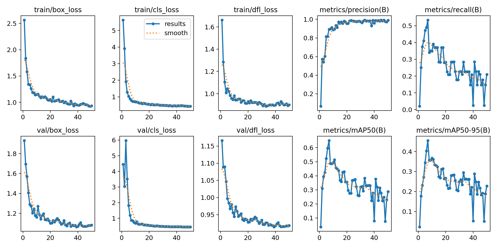
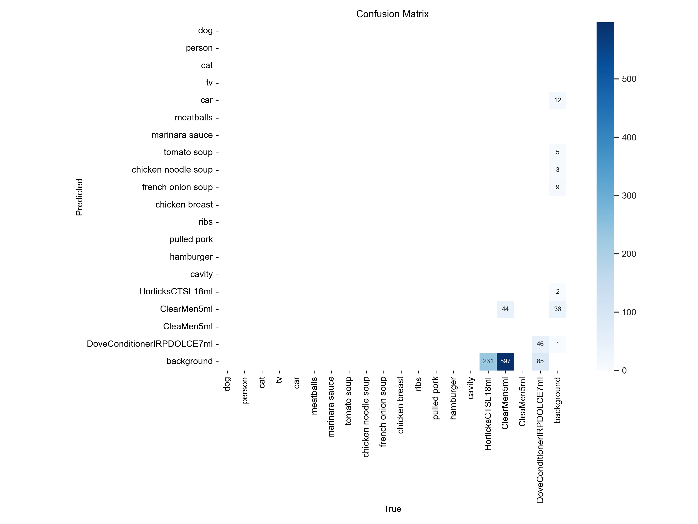
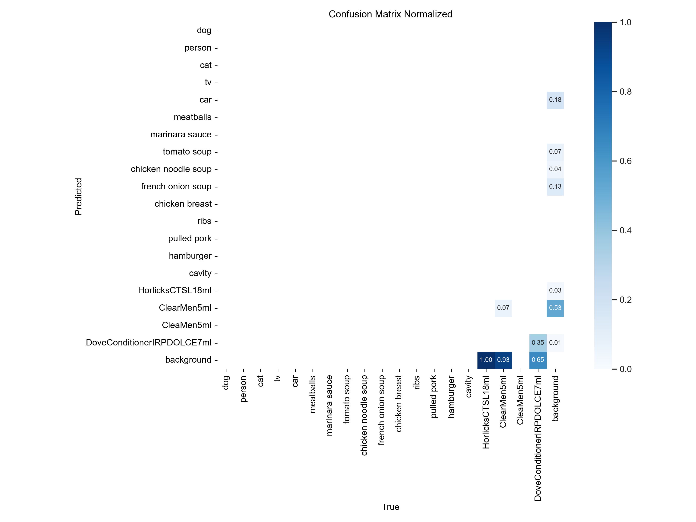
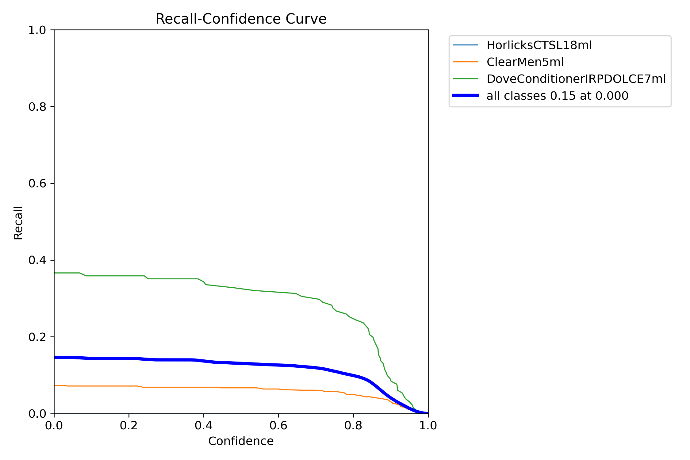
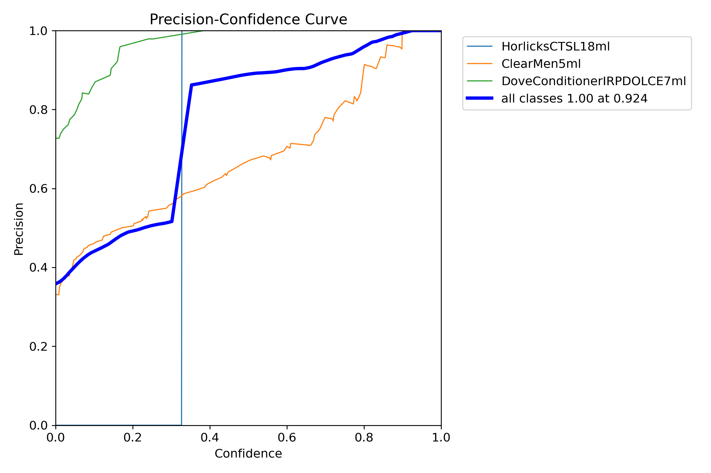
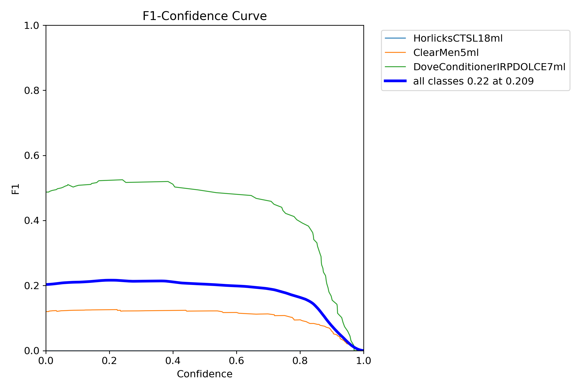
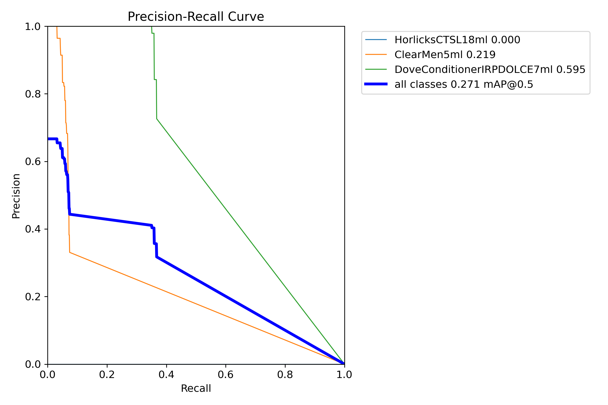
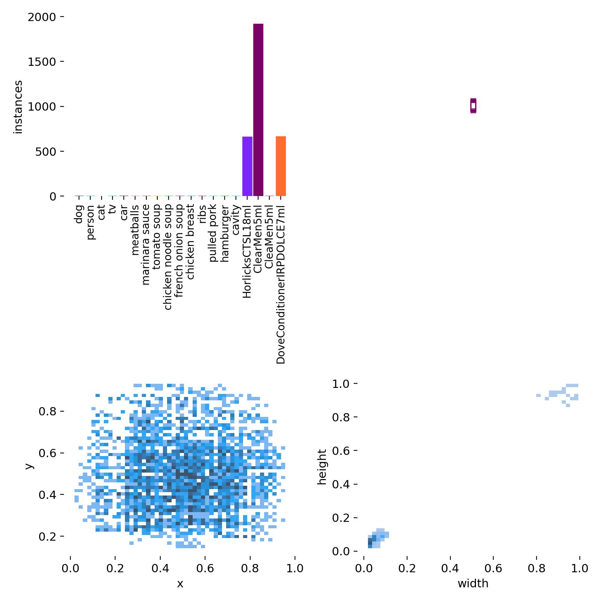
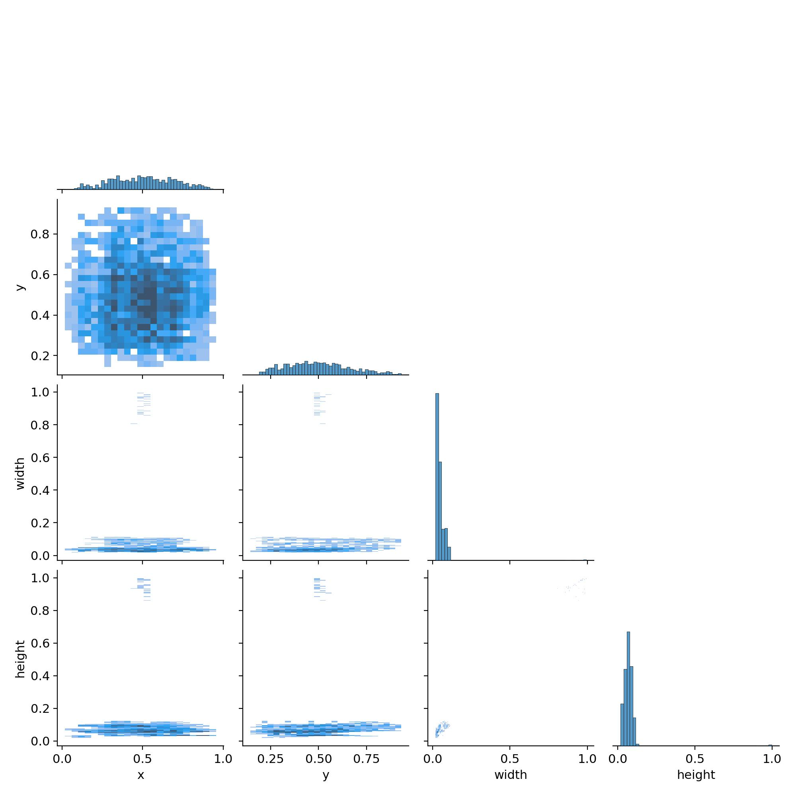

# **Retail Analysis, Adib's Training Report**

## **1. Overview**
This report will summarize the training performance of the **UBL product detection model (specifically for Clear Men's Shampoo (5ml), Dove Conditioner (7ml), and Horlicks (18ml))** using YOLOv8. The model was trained for **50 epochs**, and key results are presented below.

---

## **2. Training Performance**
### **Loss Curves**
- The loss curves indicate that the model is learning. 
- Training and validation loss decrease consistently, with no major signs of overfitting.

**Loss Curves:**

---

## **3. Model Accuracy**
### **Confusion Matrices**
The confusion matrix shows how well the model classified different products.

- **HorlicksCTSL18ml** was not detected correctly.

**Confusion Matrix (Raw Count):**  

**Confusion Matrix (Normalized):**  

---

## **4. Precision, Recall, and F1-Score**
These curves help analyze the model’s detection reliability.

### **Recall-Confidence Curve**
- The model’s recall decreases as confidence increases.
- Some classes struggle to achieve high recall.

### **Precision-Confidence Curve**
- Precision improves at higher confidence thresholds.
- Lower confidence detections tend to be inaccurate.

### **F1-Confidence Curve**
- The best balance between precision and recall occurs at **low to mid-confidence levels**.

### **Precision-Recall Trade-off**
- **DoveConditionerIRPDOLCE7ml** has the highest mAP score.
- **HorlicksCTSL18ml** was not detected at all.

---

## **5. Dataset Analysis**
### **Class Distribution**
- **ClearMen5ml and HorlicksCTSL18ml** have significantly more instances than other classes.
- This imbalance may affect detection performance.

### **Bounding Box Analysis**
- Bounding boxes are well-distributed but show **clustering in certain areas**.
- The dataset may need further augmentation to diversify bounding box locations.

---

## **6. Key Takeaways**
### **What Went Well**
- The model learned effectively, with decreasing loss.
- Precision improves with higher confidence thresholds.
- Some classes, such as **DoveConditionerIRPDOLCE7ml**, perform well.

### **Challenges**

- **Low recall and mAP scores indicate potential dataset imbalances.**

### **Recommendations**
- **Increase training epochs** to allow the model to generalize better.

---

## **7. Conclusion**
This model shows promise but requires improvements in **training duration**. Addressing these issues should lead to **higher recall and improved overall accuracy**.
